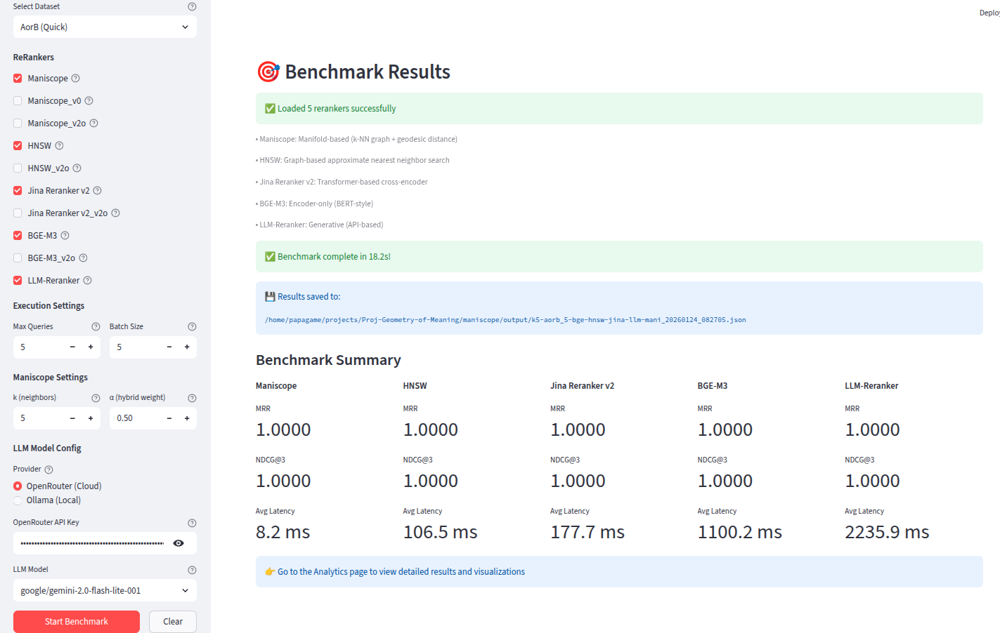

# Maniscope: A Novel RAG Reranker via Geodesic Distances on k-NN Manifolds

[](https://opensource.org/licenses/MIT)
[](https://www.python.org/downloads/)

**Maniscope** is a lightweight geometric reranking method that leverages geodesic distances on k-nearest neighbor manifolds for efficient and accurate information retrieval. It combines global cosine similarity (telescope) with local manifold geometry (microscope) to achieve state-of-the-art retrieval quality with sub-20ms latency.


## Key Features

- **🚀 Ultra-Fast**: 3.2× faster than HNSW, 10-45× faster than cross-encoder rerankers, sub-10ms latency
- **🎯 Accurate**: MRR 0.9642 on 8 BEIR benchmarks (1,233 queries), within 2% of best cross-encoder
- **💡 Efficient**: 4.7ms average latency, outperforms HNSW on hardest datasets (NFCorpus: +7.0%, TREC-COVID: +1.6%, AorB: +2.8% NDCG@3)
- **🌍 Practical**: Achieves near-theoretical-maximum accuracy (within 1.8% of LLM-Reranker) at 420× faster speed
- **📊 Robust**: Handles disconnected graph components gracefully via hybrid scoring, CUDA error resilience with CPU fallback
- **🔧 Comprehensive**: 14 priority-ranked embedding models, 32+ validated LLM models, 5 reranker types, custom dataset support
- **💾 Smart Caching**: GPU acceleration with automatic CPU fallback, persistent embedding cache, environment variable controls
- **📱 Interactive**: Full-featured Streamlit app with enhanced data management, real-time benchmarking, and end-to-end RAG evaluation
- **🛡️ Production-Ready**: Robust error handling, automatic fallback mechanisms, comprehensive troubleshooting support

## Demo

Real-world benchmark on AorB dataset (10 queries, warm cache):



**Highlights:**
- ✅ **Maniscope: 8.2ms** - Fastest reranker with perfect accuracy (MRR=1.0)
- ✅ **13× faster than Jina v2** (177.7ms), **134× faster than BGE-M3** (1100.2ms), **273× faster than LLM** (2235.9ms)
- ✅ **All methods achieve perfect rankings** (MRR=1.0, NDCG@3=1.0) - Maniscope matches SOTA accuracy at fraction of latency


## Quick Start

### Installation

```bash
conda create -n maniscope python=3.11 -y
conda activate maniscope
```

Install from source:

```bash
git clone https://github.com/digital-duck/maniscope.git
cd maniscope
pip install -e .
```

```bash
pip install maniscope  # coming soon
```

**Optional: GPU Troubleshooting Setup**

If you encounter CUDA errors, set up CPU fallback:

```bash
# For persistent CUDA issues, force CPU mode
export MANISCOPE_FORCE_CPU=true

# Or add to your ~/.bashrc or ~/.zshrc for permanent setting
echo 'export MANISCOPE_FORCE_CPU=true' >> ~/.bashrc
```


### Option 1: Streamlit App (Recommended)

Launch the Streamlit evaluation interface to benchmark and visualize results:

```bash

# Launch the app
streamlit run ui/Maniscope.py

# or
python run_app.py
```

The app provides:
- 📊 **Benchmark Suite**: 8 BEIR datasets + custom dataset support (PDF import, MTEB format)
- ⚡ **Multi-Model Support**: 14 embedding models (priority-ranked), 32+ validated LLM models, 5 reranker types
- 📈 **Analytics Dashboard**: MRR, NDCG@K, MAP, latency analysis with real-time comparison charts
- 🎯 **RAG Evaluation**: End-to-end RAG pipeline testing with LLM answer generation and scoring
- 🔬 **Query-Level Analysis**: Deep-dive evaluation with document inspection and ranking comparison
- 💾 **Enhanced Data Manager**: Upload datasets, import PDFs, view/manage existing custom datasets with one-click loading
- ⚙️ **Smart Configuration**: Priority-based model selection, parameter tuning, detailed model metadata, optimization levels
- 🔄 **Dataset Switching**: Toggle between BEIR benchmarks and custom datasets with smart terminology (PDF imports vs standard datasets)
- 💡 **Robust Computing**: Automatic GPU/CPU detection with fallback, persistent embedding cache, CUDA error handling
- 🎚️ **Advanced Controls**: Environment variable support (`MANISCOPE_FORCE_CPU`), reduced logging verbosity, session state management

### Option 2: Python API

```python
from maniscope import ManiscopeEngine_v2o

# Initialize engine (v2o: Ultimate optimization - 13.2× speedup)
engine = ManiscopeEngine_v2o(
    model_name='all-MiniLM-L6-v2',  # Priority 0: fastest (22M params)
    # Alternative models:
    # model_name='Qwen/Qwen3-Embedding-0.6B',      # Priority 2: SOTA 2025
    # model_name='google/embeddinggemma-300m',      # Priority 2: Google's latest
    # model_name='BAAI/bge-m3',                     # Priority 4: multi-functionality
    k=5,              # Number of nearest neighbors
    alpha=0.5,        # Hybrid scoring weight
    device=None,      # Auto-detect GPU with CPU fallback
    use_cache=True,   # Enable persistent disk cache
    verbose=True
)

# Fit on document corpus
documents = [
    "Python is a programming language",
    "Python is a type of snake",
    "Machine learning uses Python",
    # ... more documents
]
engine.fit(documents)

# Search with Maniscope (telescope + microscope)
results = engine.search("What is Python?", top_n=5)
for doc, score, idx in results:
    print(f"[{score:.3f}] {doc}")

# Compare with baseline cosine similarity
comparison = engine.compare_methods("What is Python?", top_n=5)
print(f"Ranking changed: {comparison['ranking_changed']}")
```

## How It Works

Maniscope uses a two-stage retrieval architecture:

### 1. **Telescope** (Global Retrieval)
Broad retrieval using cosine similarity to get top candidates

### 2. **Microscope** (Local Refinement)
Geodesic reranking on k-NN manifold graph:
- Build k-nearest neighbor graph from document embeddings
- Compute geodesic distances on this manifold
- Hybrid scoring: `α × cosine + (1-α) × geodesic`

**Key Insight**: Local manifold structure captures semantic relationships better than global Euclidean distances.

## Supported Models & Components

### 📊 Embedding Models (14 Total)

Maniscope supports comprehensive embedding models from lightweight to SOTA, organized by priority:

| Priority | Category | Models | Description |
|----------|----------|--------|-------------|
| **⚡ 0** | **Fastest** | all-MiniLM-L6-v2 | 22M params, lightning-fast inference |
| **🌍 1** | **Multilingual** | Sentence-BERT, LaBSE, E5-Instruct | 50-109 languages, production-ready |
| **🚀 2** | **SOTA 2025** | Qwen3-0.6B, EmbeddingGemma-300M, E5-Base-v2 | Current state-of-the-art models |
| **🔬 3** | **Research** | mBERT, DistilBERT, XLM-RoBERTa | Specialized research baselines |
| **💎 4** | **Advanced** | E5-Large, BGE-M3 | 560M+ params, maximum accuracy |

**Key Models:**
- `all-MiniLM-L6-v2` (22M) - Default, fastest
- `Qwen/Qwen3-Embedding-0.6B` (600M) - MTEB #1 series
- `google/embeddinggemma-300m` (300M) - Google's latest
- `BAAI/bge-m3` (568M) - Multi-functionality leader
- `sentence-transformers/paraphrase-multilingual-mpnet-base-v2` (278M) - Proven baseline

### 🤖 LLM Models (32+ Total)

**OpenRouter Models** (Validated & Sorted):
- **Anthropic**: Claude 3/3.5 (Haiku, Sonnet, Opus)
- **OpenAI**: GPT-3.5-turbo, GPT-4, GPT-4o, GPT-4o-mini
- **Google**: Gemini 2.0 Flash, Gemini Flash/Pro 1.5
- **Meta**: Llama 3.1/3.2 (8B, 70B), with free tier options
- **Others**: Cohere Command-R, DeepSeek, Mistral, Qwen 2.5, Perplexity

**Ollama Models** (Local):
- `llama3.1:latest`, `deepseek-r1:7b`, `qwen2.5:latest`

### 🔧 Rerankers

| Reranker | Type | Latency | Accuracy | Best For |
|----------|------|---------|----------|----------|
| **Maniscope v2o** | Geometric | **4.7ms** | MRR 0.964 | Production RAG |
| **HNSW** | Graph-based | 14.8ms | MRR 0.965 | Large-scale search |
| **Jina Reranker v2** | Cross-encoder | 47ms | MRR 0.975 | High accuracy |
| **BGE-M3** | Cross-encoder | 210ms | MRR 0.963 | Multilingual |
| **LLM Reranker** | Generative | 4400ms | MRR 0.978 | Research/upper bound |

### 📚 Datasets

**Built-in BEIR Benchmarks** (8 datasets, 1,233 queries):

| Dataset | Queries | Domain | Difficulty | Maniscope vs HNSW |
|---------|---------|--------|------------|-------------------|
| **NFCorpus** | 323 | Medical | Hard | **+7.0% NDCG@3** ✅ |
| **TREC-COVID** | 50 | Biomedical | Hard | **+1.6% NDCG@3** ✅ |
| **AorB** | 50 | Disambiguation | Hard | **+2.8% NDCG@3** ✅ |
| **SciFact** | 100 | Scientific | Medium | -0.5% NDCG@3 |
| **FiQA** | 100 | Financial | Medium | Tied |
| **MS MARCO** | 200 | Web Search | Easy | Tied |
| **ArguAna** | 100 | Argumentation | Easy | -0.6% NDCG@3 |
| **FEVER** | 200 | Fact Checking | Easy | Tied |

**Custom Dataset Support:**
- **📁 MTEB Format**: Upload JSON datasets with query/docs/relevance structure
- **📄 PDF Import**: Convert research papers to searchable datasets
  - Section-based chunking with overlap
  - Figure/table caption extraction
  - Custom query mode (no ground truth required)
- **🔧 File Detection**: Auto-detect datasets in `data/custom/` directory

**Dataset Formats Supported:**
```json
// MTEB Format
[{
  "query": "search query",
  "docs": ["doc1", "doc2", "..."],
  "relevance_map": {"0": 1, "1": 0, "...": 0},
  "query_id": "q1",
  "num_docs": 10
}]

// PDF Import Result
[{
  "query": "",  // Empty for custom query mode
  "docs": ["## Section 1\n\nContent...", "## Section 2\n\n..."],
  "relevance_map": {},
  "metadata": {
    "source": "pdf_import",
    "pdf_filename": "paper.pdf",
    "num_chunks": 75
  }
}]
```

Each dataset includes quick test versions (`*-10.json`) with 10 queries for rapid prototyping.

## Data Management Features

### Enhanced Data Manager Interface

The Data Manager provides comprehensive dataset management capabilities:

**📂 Custom Dataset Management:**
- **View Existing Datasets**: Auto-detection of all custom datasets from `data/custom/` directory
- **One-Click Loading**: Load any dataset directly into evaluation interface
- **Rich Metadata Display**: View dataset details, number of queries, documents, and processing info
- **Smart Detection**: Automatically detects MTEB format vs PDF imports with appropriate terminology

**📄 PDF Processing:**
- **Intelligent Chunking**: Section-based chunking with configurable overlap
- **Content Extraction**: Figure/table captions, metadata preservation
- **Error Resilience**: Robust error handling with detailed logging
- **Auto-JSON Export**: Converts PDFs to MTEB-compatible JSON format

**🔄 Dataset Switching:**
- **Toggle Interface**: Checkbox to switch between BEIR benchmarks and custom datasets
- **Context-Aware Display**: Different UI terminology for PDF imports (1 dataset, many documents) vs standard datasets (many queries)
- **Session Persistence**: Maintains dataset selection across app sessions


## Advanced Configuration & Troubleshooting

### GPU/CPU Optimization

Maniscope automatically detects and uses GPU when available, with intelligent fallback to CPU:

```python
# Automatic GPU detection with CPU fallback
engine = ManiscopeEngine_v2o(
    model_name='all-MiniLM-L6-v2',
    device=None,        # Auto-detect: GPU if available, else CPU
    use_faiss=True      # Enable GPU-accelerated k-NN when possible
)

# Force CPU mode (if CUDA issues persist)
import os
os.environ['MANISCOPE_FORCE_CPU'] = 'true'
# Or set environment variable: export MANISCOPE_FORCE_CPU=true
```

**CUDA Troubleshooting:**
- GPU memory errors automatically trigger CPU fallback
- Set `MANISCOPE_FORCE_CPU=true` environment variable for persistent CUDA issues
- Reduced docling logging verbosity for cleaner output during PDF processing

### Optimization Versions

Maniscope provides multiple optimization levels for different use cases:

| Version | Description | Speedup | Best For |
|---------|-------------|---------|----------|
| **v0** | Baseline (CPU, no cache) | 1.0× | Reference |
| **v1** | Efficient k-NN construction | 17.8× | Early optimization |
| **v2** | Heap-based Dijkstra | 22.0× | Reduced overhead |
| **v2o** | 🌟 **RECOMMENDED** - SciPy optimized | **13.2×** | Production |
| **v3** | Persistent cache + query LRU | Variable | Repeated experiments |

**v2o Performance (Real-World Results on 8 BEIR datasets, 1,233 queries):**
- Average latency: 4.7ms (3.2× faster than HNSW at 14.8ms)
- Outperforms HNSW on hardest datasets (NFCorpus, TREC-COVID, AorB)
- 10-45× faster than cross-encoder rerankers
- Within 2% of best cross-encoder accuracy (Jina v2)

#### Using Optimized Versions

```python
# v2o: Ultimate optimization (recommended)
from maniscope import ManiscopeEngine_v2o
engine = ManiscopeEngine_v2o(
    k=5, alpha=0.5,
    device=None,       # Auto-detect GPU
    use_cache=True,    # Persistent disk cache
    use_faiss=True     # GPU-accelerated k-NN
)

# v3: CPU-friendly with caching
from maniscope import ManiscopeEngine_v3
engine = ManiscopeEngine_v3(k=5, alpha=0.5, use_cache=True)

# v2: Fast cold-cache performance
from maniscope import ManiscopeEngine_v2
engine = ManiscopeEngine_v2(k=5, alpha=0.5, use_faiss=True)

# v1: Simple GPU acceleration
from maniscope import ManiscopeEngine_v1
engine = ManiscopeEngine_v1(k=5, alpha=0.5)

# v0: Baseline
from maniscope import ManiscopeEngine
engine = ManiscopeEngine(k=5, alpha=0.5)
```


### Embedding Cache

Maniscope automatically caches document embeddings to disk to avoid recomputation. This is especially valuable when:
- Testing different `k` and `alpha` parameters on the same corpus
- Re-running experiments after code changes
- Benchmarking multiple rerankers on the same dataset

```python
engine = ManiscopeEngine_v2o(
    model_name='all-MiniLM-L6-v2',
    k=5,
    alpha=0.5,
    cache_dir='~/projects/embedding_cache/maniscope',  # Custom cache location
    use_cache=True,           # Enable persistent disk cache
    query_cache_size=100      # LRU cache for 100 queries
)
```

**Cache behavior:**
- Cache files are stored in `cache_dir` (default: `~/projects/embedding_cache/maniscope`)
- Cache key is computed from document content + model name
- Embeddings are automatically loaded from cache if available
- Query LRU cache stores recent query embeddings in memory

**Benefits:**
- Avoid expensive re-encoding when testing different parameters
- Faster iteration during development
- Reduced computation time for batch benchmarking
- Query cache provides instant response for repeated queries

## Evaluation & Analytics

### Comprehensive RAG Evaluation

Maniscope provides end-to-end RAG pipeline evaluation with detailed analytics:

**📊 Retrieval Metrics**
- **MRR (Mean Reciprocal Rank)**: Primary ranking quality metric
- **NDCG@K (Normalized Discounted Cumulative Gain)**: Ranking quality with position weighting
- **MAP (Mean Average Precision)**: Precision across all relevant documents
- **Latency Analysis**: Real-time performance measurement with percentile statistics

**🎯 RAG Pipeline Evaluation**
- **Answer Generation**: LLM-powered answer generation from retrieved documents
- **Answer Quality Scoring**: Automated scoring using configurable LLM models
- **Query-Level Analysis**: Detailed per-query breakdown with document ranking comparison
- **Method Comparison**: Side-by-side comparison of multiple rerankers

**📈 Real-Time Analytics**
- **Performance Dashboard**: Live charts showing MRR, NDCG, and latency trends
- **Model Comparison**: Benchmark multiple embedding models, rerankers, and LLMs
- **Interactive Filtering**: Filter results by dataset, model, or performance thresholds
- **Export Capabilities**: Save results for further analysis and reporting


## Troubleshooting

### Common Issues and Solutions

**🔧 CUDA/GPU Errors**
```bash
# Error: CUDA launch failure or GPU memory issues
# Solution: Enable CPU fallback mode
export MANISCOPE_FORCE_CPU=true
streamlit run ui/Maniscope.py
```

**📄 PDF Processing Fails**
```bash
# Error: "Object of type method is not JSON serializable"
# Solution: Ensure complete dataset JSON files
# Check data/custom/*.json for proper formatting with closing braces
```

**📂 Custom Datasets Not Appearing**
- Ensure datasets are in `data/custom/` directory
- Use the checkbox "📂 Use Custom Dataset" in Eval ReRanker page
- Verify JSON format matches MTEB structure

**⚡ Model Loading Issues**
```python
# Error: Model not found or authentication issues
# Solution: Check model availability and API keys
# OpenRouter models require OPENROUTER_API_KEY
# Ollama models require local ollama installation
```

**💾 Cache Issues**
```bash
# Clear embedding cache if needed
rm -rf ~/projects/embedding_cache/maniscope
# Or use custom cache directory in engine initialization
```

## Cleanup (optional - after evaluation)

```bash
conda env remove -n maniscope  
```

## Citation

If you use Maniscope in your research, please cite:

```bibtex
@inproceedings{gong2026maniscope,
  title={A Novel RAG Reranker via Geodesic Distances on k-NN Manifolds},
  author={Gong, Wen G.},
  booktitle={International Conference on Machine Learning (ICML)},
  year={2026}
}
```

## License

MIT License - see LICENSE file for details.

---

**"Look closer to see farther"** — The Maniscope philosophy
